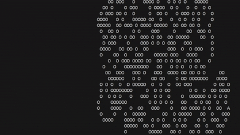

# Langton's Ant

A simple terminal-based implementation of **Langton's Ant**, a fascinating cellular automaton created by Chris Langton.

This project is intended as a **beginner programming and logic-building exercise**. It builds on concepts introduced in the Conway's Game of Life project while introducing a different type of simulation.

> **Before looking at the implementation, read about Langton's Ant on Wikipedia:**
> https://en.wikipedia.org/wiki/Langton%27s_ant

## About

Langton's Ant consists of:

* A grid of cells
* An ant
* A direction the ant is facing
* A set of simple rules



Initially, every cell on the grid is white and the ant starts in the middle of the grid.

The ant follows two simple rules:

### On a Set Cell

1. Turn **right**
2. Change the cell from white to black
3. Move forward

### On a UnSet Cell

1. Turn **left**
2. Change the cell from black to white
3. Move forward

Despite these extremely simple rules, the ant eventually produces surprisingly complex behavior.

## Running the Simulation

Make sure Python is installed, then run:

```bash
python main_tui.py
```

The simulation will run continuously in the terminal.

Press:

```text
Ctrl + C
```

to stop it.


## Exercises

### 1. Apply DRY

DRY stands for:

> **Don't Repeat Yourself**

Look at:

```text
turn_and_move_ant_right()
turn_and_move_ant_left()
```

There is quite a bit of duplicated code between these functions.

Try to refactor the implementation so that the repeated logic is removed.

Think about whether you can use:

* A single movement function
* A single turning function
* Direction calculations

without changing the behavior of the simulation.

### 2. Follow the Single Responsibility Principle

Some of the current functions are doing more than one thing.

For example:

```text
turn_and_move_ant_right()
```

both **turns** the ant and **moves** the ant.

Likewise for the left-turn function.

Try refactoring these into smaller functions where each function does exactly what its name promises.

The goal is not to blindly create more functions.

The goal is to make each function have a **clear responsibility** so that when something goes wrong, you know exactly where to look.

### 2. Experiment With the Rules

Change the rules.
Add your own rules.

Experiment!

**Happy Programming!**

— Tejas
